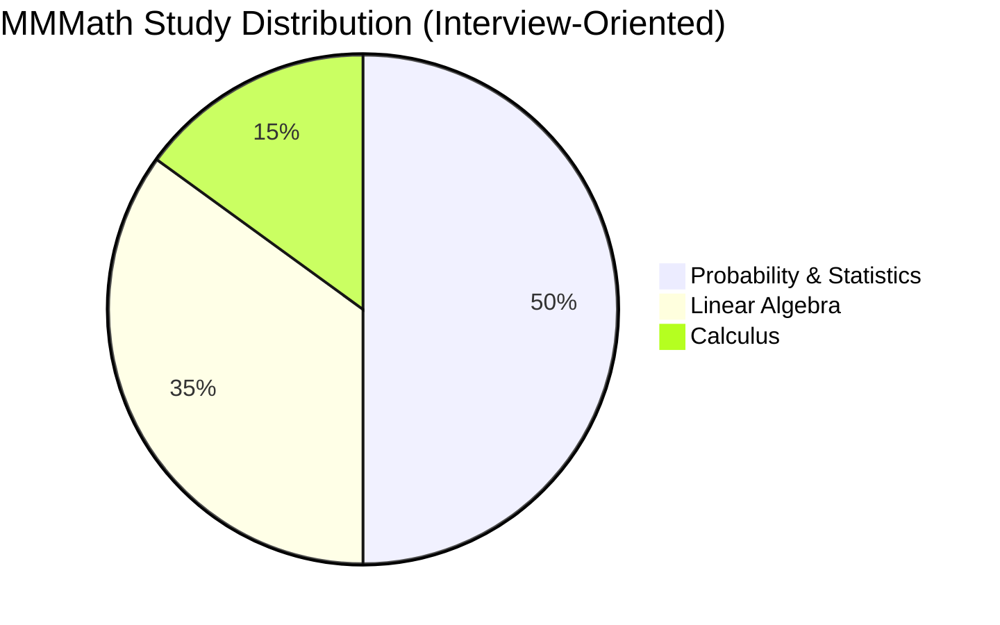

# Machine Learning Math Roadmap

Most people think ML requires years of Math. In reality, most ML relies on just three areas.

|%age| Topic|
|||
|||
|||
|||

---

## Recommended Learning Order
Follow this sequence:
1. Probability
2. Statistics
3. Linear Algebra
4. Calculus
5. ML-specific concepts built on top of the math.

---

