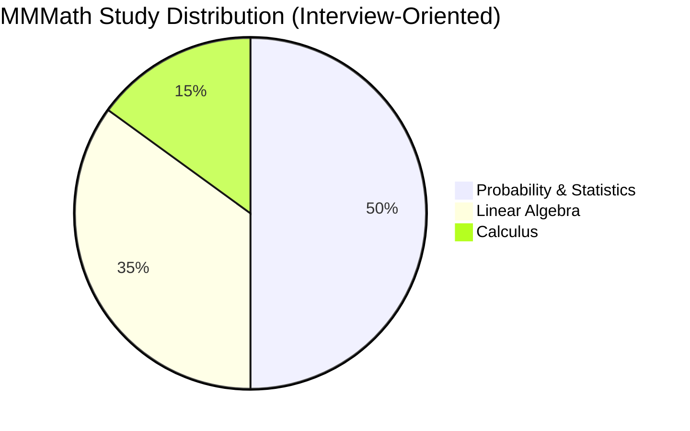

# Machine Learning Math Roadmap

Most people think ML requires years of Math. In reality, most ML relies on just three areas.

---

## Recommended Learning Order
Follow this sequence:
1. Probability
2. Statistics
3. Linear Algebra
4. Calculus
5. ML-specific concepts built on top of the math.

---

## Probability (Most Important)
Probability forms the foundation of prediction, uncertainty, and modeling in ML.  
Many ML algorithms assume probabilistic interpretations.  
**Examples**:
- Naive Bayes 
- Logistic regression 
- Bayesian models 
- Generative models 

### Topics to Learn
Start with these concepts:

<strong>Core Concepts</strong>

- Random variables (discrete vs continuous)
- Probability distributions 
- Joint, marginal, and conditional probability 
- Bayes' theorem

<strong>Statistical Quantities</strong>

- Expectation 
- Variance 
- Covariance 
- Correlation

<strong>Important Theorems</strong>

- Law of Large Numbers 
- Central Limit Theorem

<strong>Important Distributions</strong>

- Normal distribution 
- Bernoulli distribution 
- Binomial distribution 
- Poisson distribution 
- Exponential distribution 
- Uniform distribution

<strong>Advanced (Optional, but Useful)</strong>

- Probability inequalities 
- Markov chains 
- Markov Chain Monte Carlo (MCMC)

### Best Resources

| Resource                     | Links                                                                                                                                                                      |
|:-----------------------------|:---------------------------------------------------------------------------------------------------------------------------------------------------------------------------|
| `Book (Free PDF)`            | [Introduction to Probability — Harvard](https://uni.dcdev.ro/y2s2/ps/Introduction%20to%20Probability%20by%20Joseph%20K.%20Blitzstein,%20Jessica%20Hwang%20(z-lib.org).pdf) |
| `Course`                     | [Harvard edX Probability Course](https://www.edx.org/learn/probability/harvard-university-introduction-to-probability)                                                     |
| `Video (Best intuition)`     | [StatQuest](https://www.youtube.com/c/joshstarmer)                                                                                                                         |                      |                                                                                                                                                                            |
                                                                                                                                                            |
---

## Statistics
Statistics helps us **evaluate models, analyze experiments, and interpret results**.

It is extremely important in:
- ML experiment
- Model Validation
- A/ B Testing
- Product Analytics

### Topics to Learn

<strong>Descriptive Statistics</strong>

- Mean 
- Median 
- Mode 
- Variance 
- Standard deviation 
- Skewness 
- Kurtosis

<strong>Sampling</strong>

- Sampling Techniques
- Sampling Bias
- Population vs Sample

<strong>Inferential Statistics</strong>

- Confidence Intervals
- Hypothesis Testing

<strong>Statistical Tests</strong>

- `t-test`
- `z-test`
- `Chi-square test`
- `Analysis of Variance (ANOVA)`

<strong>Errors in Testing</strong>

- Type I Error
- Type II Error
- Statistical power

### ML-Relevant Statistical Concepts
These appear frequently in ML system:
* Maximum Likelihood Estimation (MLE)
* Maximum A Posteriori (MAP)
* Bias–variance tradeoff 
* Cross-validation 
* Overfitting vs underfitting 
* Feature importance 
* A/B testing 
* Evaluation metrics

Evaluation Metrics include:
* Accuracy
* Precision
* Recall
* F-1 Score
* ROC-AUC

### Best Resources

| Resource         | Links                                                                                                                   |
|:-----------------|:------------------------------------------------------------------------------------------------------------------------|
| `Website`        | [Probability](https://www.probabilitycourse.com/)   Focus particulary on Chapter 8 (classical statistical methods)/ |
| `Video Resource` | [StatQuest](https://www.youtube.com/c/joshstarmer)                                                                      |
| `Statistics`     | [Khan Academy](https://www.khanacademy.org/math/statistics-probability)                                                 |

---

## Linear Algebra
Linear algebra powers almost every ML Model.

Neutral networks are essentially **large matrix operations**.

Understanding linear algebra helps explain:
* Embeddings
* PCA
* Neural Networks
* Dimensionality Reduction

### Topics to Learn

<strong>Vectors</strong>

- Vector Operations
- Dot Product
- Norms

<strong>Matrices</strong>

- Matrix Multiplication
- Matrix Transpose
- Matrix Inverse

<strong>Linear Transformation</strong>

<strong>Eigen Values and Eigen Vectors</strong>

<strong>Projections</strong>

<strong>Orthogonality</strong>

<strong>Singular Value Decomposition (SVD)</strong>

(Conceptual Understanding is enough)

### Best Resources

| Topic                                  | Resource                                                                                                                                                                         |
|:---------------------------------------|:---------------------------------------------------------------------------------------------------------------------------------------------------------------------------------|
| `Visual Learning (Highly Recommended)` | [ 3Blue1Brown &mdash; Essence of Linear Algebra](https://www.youtube.com/playlist?list=PLZHQObOWTQDPD3MizzM2xVFitgF8hE_ab)                                                       |
| `Course`                               | [Khan Academy Linear Algebra](https://www.khanacademy.org/math/linear-algebra)                                                                                                   |
| `Advanced Course`                      | [UT Austin &mdash; Linear Algebra Foundation to Frontiers](https://www.edx.org/learn/linear-algebra/the-university-of-texas-at-austin-linear-algebra-foundations-to-frontiers)   |

---

## Calculus (Optimization)

Calculus helps explain how ML models learn.  
Training neural networks involves optimization using gradients. 
Fortunately, you need a subset of calculus.

### Topics to Learn

| Topic                                                                                                                                                                                    | Resource                                                                                                                                                                                         |
|:-----------------------------------------------------------------------------------------------------------------------------------------------------------------------------------------|:-------------------------------------------------------------------------------------------------------------------------------------------------------------------------------------------------|
| `Books`                                                                                                                                                                                  | [Mathematical for Machine Learning Book (Free)](https://mml-book.github.io/book/mml-book.pdf)   [Multivariable Calculus (Free Textbook)](https://www.whitman.edu/mathematics/multivariable/) |
| `Videos`                                                                                                                                                                                 | [Khan Academy Calculus](https://www.khanacademy.org/math/calculus-1)                                                                                                                             |

---

## ML Concepts Built on This Math

Once you learn the above math, the following ML Concepts become much easier.

<strong>Regression</strong>

- Linear Regression
- Ordinary Least Square (OLS)
- Regression assumptions
- Multicollinearity
- Residual Analysis
- Heteroskedasticity

<strong>Regularization</strong>

- L1 Regularization (Lasso)
- L2 Regularization (Ridge)

<strong>Classification</strong>

- Logistic regression
- Decision Boundaries
- Sigmoid Function

<strong>Model Evaluation</strong>

- Cross-Validation
- Bias &mdash; variance tradeoff
- Overfitting vs underfitting

<strong>ML Metrics</strong>

- Accuracy
- Precision
- Recall
- F1-Recall
- ROC-AUC

---
## Bonus: Best Series to Understand Neural Networks
This series explains neural networks from scratch. 
Highly recommended.

[Andrej Karpathy — Neural Networks: Zero to Hero](https://www.youtube.com/watch?v=VMj-3S1tku0)

---

## Final Advice

The most effective learning strategy is:

