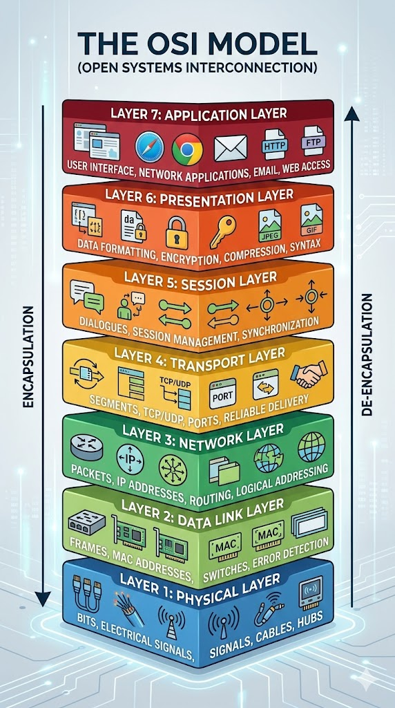

# OSI Model (All 7 layers)

## The Seven Layers

## Layers Explained

## Layer 1: Physical Layer

**What is the Physical Layer?**
- Transmits raw bits (0s and 1s) over a physical medium.
- It deals with hardware — cables, signals, and electricity.

**Medium Types**
- Wired — Ethernet cables, fiber optic
- Wireless — Radio waves, Wi-Fi signals

**Responsibilities**
- Bit transmission
- Signal conversion (digital ↔ electrical/optical)
- Data rate control (how fast bits travel)

**Real-World Example**
- The ethernet cable plugged into your router → Physical Layer

---

## Layer 2: Data Link Layer

**What is the Data Link Layer?**
- Transfers data between two directly connected devices.
- It packages raw bits into frames and handles errors at the local level.

**Key Concepts**
- MAC Address — unique hardware address of every device
- Frames — data packaged for local delivery

**Protocols**
- Ethernet
- Wi-Fi (802.11)
- PPP (Point-to-Point Protocol)

**Responsibilities**
- Framing (wrapping data into frames)
- MAC addressing
- Error detection (not correction)
- Flow control between two nodes

**Real-World Example**
- Your laptop talking to your Wi-Fi router → Data Link Layer

---

## Layer 3: Network Layer

**What is the Network Layer?**
- Handles routing of data across multiple networks.
- It decides the best path for data to travel from source to destination.

**Key Concepts**
- IP Address — logical address used to identify devices across networks
- Packets — unit of data at this layer

**Protocols**
- IP (Internet Protocol) — IPv4 and IPv6
- ICMP (used by ping)
- Routers operate at this layer

**Responsibilities**
- Logical addressing (IP addresses)
- Routing (finding the best path)
- Packet forwarding across networks

**Real-World Example**
- Sending a message from India to the US — the network layer figures out the path → Network Layer

---

## Layer 4: Transport Layer

**What is the Transport Layer?**
- Ensures reliable data delivery end-to-end.
- It controls data flow and error checking.

**Protocols**
- TCP (Transmission Control Protocol)
- UDP (User Datagram Protocol)

**TCP vs UDP**

TCP — Reliable, Error checking, Slower
UDP — Faster, No guarantee, Used in streaming

**Responsibilities**
- Segmentation (breaking data into chunks)
- Flow control
- Error recovery

**Real-World Example**
- WhatsApp message → TCP
- Live video streaming → UDP

---

## Layer 5: Session Layer

**What is the Session Layer?**
- Manages sessions — it opens, maintains, and closes communication sessions between devices.
- Think of it as the coordinator that keeps a conversation alive.

**Key Concepts**
- Session — a continuous exchange of information between two devices
- Authentication and authorization happen here

**Protocols**
- NetBIOS
- PPTP (Point-to-Point Tunneling Protocol)
- RPC (Remote Procedure Call)

**Responsibilities**
- Session establishment, maintenance, and termination
- Synchronization (checkpoints in data transfer — if it fails, resume from last checkpoint)
- Dialog control (who sends when)

**Real-World Example**
- Logging into your Google account — the session stays alive while you browse → Session Layer

---

## Layer 6: Presentation Layer

**What is the Presentation Layer?**
- Translates data into a format the application can understand.
- It is the layer responsible for encryption, compression, and data formatting.

**Key Concepts**
- Encryption — securing data before transmission (SSL/TLS)
- Compression — reducing data size for faster transfer
- Translation — converting data formats (e.g. EBCDIC to ASCII)

**Formats handled**
- JPEG, PNG, MP4, GIF (media formats)
- ASCII, Unicode (text encoding)
- SSL/TLS (encryption)

**Responsibilities**
- Data translation and formatting
- Encryption and decryption
- Compression and decompression

**Real-World Example**
- Visiting an HTTPS website — your data is encrypted before sending → Presentation Layer

---

## Layer 7: Application Layer

**What is the Application Layer?**
- The layer closest to the end user.
- It provides network services directly to applications — this is what you actually interact with.

**Key Concepts**
- This is NOT the app itself (like Chrome or Gmail) — it is the protocol that app uses to communicate.

**Protocols**
- HTTP / HTTPS — web browsing
- FTP — file transfer
- SMTP / IMAP / POP3 — email
- DNS — domain name resolution
- DHCP — IP address assignment

**Responsibilities**
- Providing an interface between the network and the application
- Data presentation to the user
- Identifying communication partners
- Ensuring resource availability

**Real-World Example**
- Typing google.com in your browser → DNS resolves the name, HTTP fetches the page → Application Layer
