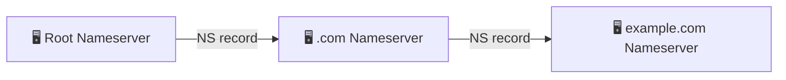

# Networking for Devops

## What is a Network?
When two or more computers and computing devices connected together with each other
through communication channels, such as cables or wireless media and sharing some
files, then it is called a Network.

A network is used to:
* Allow the connected devices to communicate with each other.
* Enable multiple users to share devices over the network, such as music and video servers, printers and scanners.

The internet is the largest network in the world and can be called _the network of networks_.

## Types of Networks
There are different types of networks, but the main two are **LAN** and **WAN**
1. LAN (Local Area Network) - interconnects computer within a limited area, such as residences, schools. e.g., Wi-Fi, Ethernet
2. MAN (Metropolitan Area Network)- used in metropolitan area (cities).
3. WAN (Wide Area Network)
4. SONET (Synchronous Optical Network) - used in submarine.

## Network Components

<strong>Router</strong>

Think of this as a traffic controller. It directs information between different
network, like making sure the data from your home network finds its way to the websites
you want to visit and back.

<strong>Switch</strong>

Like a postal sorting centre for your local network. It connects different
devices within the same network (like your computer, printer, and smart TV) and makes sure data gets to the right device.

<strong>Modem</strong>

The translator between your home network and the internet. It converts the
internet signal from your service provider into something your devices can understand.

<strong>Network Cable (Ethernet)</strong>

The physical road that data travels on. Just like cars need roads, data needs
cables to move between devices when using wired connections.

<strong>Wireless Access Point (WAP)</strong>

Think of this as a radio tower for your network. It broadcasts your network
signal wirelessly so devices can connect without cables. Your home WiFi router
usually includes this.

<strong>Firewall</strong>

The security guard of your network. It watches data coming in and going out,
blocking anything suspicious that might harm your network.

<strong>Network Card</strong>

Every device's ticket to join the network. It's like having the right pass to
enter a club &mdash; without it, your device can't connect to the network. It is
known as Network Interface Card which is used to connect your computer with the internet. 
It is wireless card preinstalled on motherboard now-a-days. It has MAC (Media Access Control) address.

<strong>Server</strong>

Like a library of information and services. It stores files, runs applications, and
provides services that other computers on the network can use.

## What is a Protocol?
A network protocol is a set of rules which is set up by people that determines how a particular
data is transmitted between different devices in the same network.\
e.g., HTTP, TCP, IP, FTP, SMTP etc.

## IP Address and its Types and Classes
An IP (Internet Protocol) address is a unique number assigned to each device on a network, allowing
them to communicate with each other. Its like a device's `address` on the internet
or local network.

### Types of IP Addresses
**IPv4**
- 32-bit address, written as four numbers separated by dots (**.**)   Example: 123.89.46.7
- This is a 32-bit IP Address, means it contains a combo of 32 (1's and 0's). In this version of IP address there are 4 groups or Octets (8 bits), and each octet is represented by a decimal value in the address. It is easy to remember.
- Commonly used, but limited number of addresses (about 4.3 billion)

### IPv4 Address Format (Dotted Decimal Notation)

<table style="border:none; font-size:48px; font-weight:bold; letter-spacing:2px;">
  <tr>
    <td style="border:none; text-align:center; padding:0 10px;">123</td>
    <td style="border:none; font-size:48px; color:red;">.</td>
    <td style="border:none; text-align:center; padding:0 10px;">89</td>
    <td style="border:none; font-size:48px; color:red;">.</td>
    <td style="border:none; text-align:center; padding:0 10px;">46</td>
    <td style="border:none; font-size:48px; color:red;">.</td>
    <td style="border:none; text-align:center; padding:0 10px;">72</td>
  </tr>
  <tr style="font-size:12px; color:gray;">
    <td style="border:none; text-align:center;">First Octet</td>
    <td style="border:none;"></td>
    <td style="border:none; text-align:center;">Second Octet</td>
    <td style="border:none;"></td>
    <td style="border:none; text-align:center;">Third Octet</td>
    <td style="border:none;"></td>
    <td style="border:none; text-align:center;">Fourth Octet</td>
  </tr>
  <tr style="font-size:13px; font-family:monospace; font-weight:normal;">
    <td style="border:none; text-align:center; letter-spacing:1px;">01111011</td>
    <td style="border:none; text-align:center; color:red;">.</td>
    <td style="border:none; text-align:center; letter-spacing:1px;">01011001</td>
    <td style="border:none; text-align:center; color:red;">.</td>
    <td style="border:none; text-align:center; letter-spacing:1px;">00101110</td>
    <td style="border:none; text-align:center; color:red;">.</td>
    <td style="border:none; text-align:center; letter-spacing:1px;">01001000</td>
  </tr>
</table>

<table style="border:none; width:560px; font-size:12px; margin-top:4px;">
  <tr>
    <td style="border:none; width:33%;"><strong>↔ 1 Byte = 8 Bits</strong></td>
    <td style="border:none;"></td>
    <td style="border:none;"></td>
  </tr>
  <tr>
    <td style="border:none;" colspan="3" style="text-align:right;"><strong>◄————————— 4 Bytes = 32 Bits —————————►</strong></td>
  </tr>
</table>

 

---

**IPv6**
- 128-bit address, written in eight groups of hexadecimal numbers
- Provides a vastly larger pool of addresses, designed to replace IPv4 as it runs out.

### IPv6 Address Format (Colon Hexadecimal Notation)

<table style="border:none; font-size:28px; font-weight:bold; letter-spacing:2px;">
  <tr>
    <td style="border:none; text-align:center; padding:0 6px;">2001</td>
    <td style="border:none; font-size:28px; color:red;">:</td>
    <td style="border:none; text-align:center; padding:0 6px;">0db8</td>
    <td style="border:none; font-size:28px; color:red;">:</td>
    <td style="border:none; text-align:center; padding:0 6px;">85a3</td>
    <td style="border:none; font-size:28px; color:red;">:</td>
    <td style="border:none; text-align:center; padding:0 6px;">0000</td>
    <td style="border:none; font-size:28px; color:red;">:</td>
    <td style="border:none; text-align:center; padding:0 6px;">0000</td>
    <td style="border:none; font-size:28px; color:red;">:</td>
    <td style="border:none; text-align:center; padding:0 6px;">8a2e</td>
    <td style="border:none; font-size:28px; color:red;">:</td>
    <td style="border:none; text-align:center; padding:0 6px;">0370</td>
    <td style="border:none; font-size:28px; color:red;">:</td>
    <td style="border:none; text-align:center; padding:0 6px;">7334</td>
  </tr>

  <tr style="font-size:11px; color:gray;">
    <td style="border:none; text-align:center;">Group 1</td>
    <td style="border:none;"></td>
    <td style="border:none; text-align:center;">Group 2</td>
    <td style="border:none;"></td>
    <td style="border:none; text-align:center;">Group 3</td>
    <td style="border:none;"></td>
    <td style="border:none; text-align:center;">Group 4</td>
    <td style="border:none;"></td>
    <td style="border:none; text-align:center;">Group 5</td>
    <td style="border:none;"></td>
    <td style="border:none; text-align:center;">Group 6</td>
    <td style="border:none;"></td>
    <td style="border:none; text-align:center;">Group 7</td>
    <td style="border:none;"></td>
    <td style="border:none; text-align:center;">Group 8</td>
  </tr>

  <tr style="font-size:11px; font-family:monospace; font-weight:normal;">
    <td style="border:none; text-align:center; letter-spacing:1px;">0010000000000001</td>
    <td style="border:none; text-align:center; color:red;">:</td>
    <td style="border:none; text-align:center; letter-spacing:1px;">0000110110111000</td>
    <td style="border:none; text-align:center; color:red;">:</td>
    <td style="border:none; text-align:center; letter-spacing:1px;">1000010110100011</td>
    <td style="border:none; text-align:center; color:red;">:</td>
    <td style="border:none; text-align:center; letter-spacing:1px;">0000000000000000</td>
    <td style="border:none; text-align:center; color:red;">:</td>
    <td style="border:none; text-align:center; letter-spacing:1px;">0000000000000000</td>
    <td style="border:none; text-align:center; color:red;">:</td>
    <td style="border:none; text-align:center; letter-spacing:1px;">1000101000101110</td>
    <td style="border:none; text-align:center; color:red;">:</td>
    <td style="border:none; text-align:center; letter-spacing:1px;">0000001101110000</td>
    <td style="border:none; text-align:center; color:red;">:</td>
    <td style="border:none; text-align:center; letter-spacing:1px;">0111001100110100</td>
  </tr>

</table>

<table style="border:none; width:100%; font-size:12px; margin-top:6px;">
  <tr>
    <td style="border:none;"><strong>↔ 1 Group = 16 Bits (2 Bytes)</strong></td>
  </tr>
  <tr>
    <td style="border:none;"><strong>◄—————————————————— 8 Groups = 128 Bits (16 Bytes) ——————————————————►</strong></td>
  </tr>
</table>

---

### Public IP:
- Used to identify devices on the internet.
- Assigned by ISPs and accessible globally.

### Private IP:
- Used within private networks (like home or office networks).
  - Not accessible from the internet; usually in ranges like `192.168.x.x`, `10.x.x.x` or `172.16.x.x` &mdash; `172.31.x.x`

| Public IP Address                                                                                       | Private IP Address                                                                                                                                                                  |
|:--------------------------------------------------------------------------------------------------------|:------------------------------------------------------------------------------------------------------------------------------------------------------------------------------------|
| The Public IP address is used for internet Communication or when we must communicate over the Internet  | The Private IP address is used for Intranet Communication, and we can't use these IP addresses for   Internet communication.                                                    |
| These IP addresses are Paid (that's why we use them for WAN communication)                              | These IP addresses are Free (Most used in LAN communication)                                                                                                                        |
| Except for all the private IP addresses, all are public IP addreses                                     | Ranges are:   **Class A** = `10.0.0.0 &mdash; 10.255.255.255`   **Class B** = `172.16.0.0 &mdash; 172.31.255.255`   **Class C** = `192.168.0.0 &mdash; 192.168.255.255` |

### Static IP
* Manually assigned, doesn't change
* Often used for servers and devices that need a consistent address.

### Dynamic IP
* Automatically assigned by a DHCP (Dynamic Host Configuration Protocol) server.
* Changes periodically; commonly used for home devices.

## IP Address Classes (IPv4 Only)

There is an organisation called [**IANA**](https://www.iana.org/) (Internet Assigned Numbers Authority) who divides the IP Address into different classes. You have to know about binary to decimal conversion to understand this. Ipv4 addresses are divided into **five classes** based on starting number, which determines their usage in networks.

| Class  | Range                             | Purpose                                     |
|:-------|:----------------------------------|:--------------------------------------------|
| `A`    | 1.0.0.0 &mdash; 126.0.0.0         | Large networks, like big organizartions.    |
| `B`    | 128.0.0.0 &mdash; 191.255.0.0     | Medium-sized networks.                      |
| `C`    | 192.0.0.0 &mdash; 223.255.255.0   | Small networks, like home or business LANs. |
| `D`    | 224.0.0.0 &mdash; 239.255.255.255 | Reserved for multicasting.                  |
| `E`    | 240.0.0.0 &mdash; 255.255.255.255 | Experimental, used for research.            |

# IP Address Classes

<!-- X.X.X.X circled -->

  
    X . X . X . X
  

<table style="border-collapse: collapse; border: none; font-family: 'Courier New', monospace;">

  <!-- Powers row -->
  <tr style="text-align:center; font-size:13px;">
    <td style="border:none; width:30px;"></td>
    <td style="border:none; width:40px;">27</td>
    <td style="border:none; width:20px;"></td>
    <td style="border:none; width:40px;">26</td>
    <td style="border:none; width:20px;"></td>
    <td style="border:none; width:40px;">25</td>
    <td style="border:none; width:20px;"></td>
    <td style="border:none; width:40px;">24</td>
    <td style="border:none; width:20px;"></td>
    <td style="border:none; width:40px;">23</td>
    <td style="border:none; width:20px;"></td>
    <td style="border:none; width:40px;">22</td>
    <td style="border:none; width:20px;"></td>
    <td style="border:none; width:40px;">21</td>
    <td style="border:none; width:20px;"></td>
    <td style="border:none; width:40px;">20</td>
    <td style="border:none; width:80px;"></td>
  </tr>

  <!-- Values row -->
  <tr style="text-align:center; font-size:12px; color:#444;">
    <td style="border:none;"></td>
    <td style="border:none;">(128)</td>
    <td style="border:none;"></td>
    <td style="border:none;">(64)</td>
    <td style="border:none;"></td>
    <td style="border:none;">(32)</td>
    <td style="border:none;"></td>
    <td style="border:none;">(16)</td>
    <td style="border:none;"></td>
    <td style="border:none;">(8)</td>
    <td style="border:none;"></td>
    <td style="border:none;">(4)</td>
    <td style="border:none;"></td>
    <td style="border:none;">(2)</td>
    <td style="border:none;"></td>
    <td style="border:none;">(1)</td>
    <td style="border:none; font-style:italic; text-align:right;">(Range)</td>
  </tr>

  <!-- Row 1: 0+0+0+0+0+0+0+0 = 0-126 -->
  <tr style="text-align:center; font-size:16px;">
    <td style="border:none; text-align:left;">→</td>
    <td style="border:none;">0</td>
    <td style="border:none;">+</td>
    <td style="border:none;">0</td>
    <td style="border:none;">+</td>
    <td style="border:none;">0</td>
    <td style="border:none;">+</td>
    <td style="border:none;">0</td>
    <td style="border:none;">+</td>
    <td style="border:none;">0</td>
    <td style="border:none;">+</td>
    <td style="border:none;">0</td>
    <td style="border:none;">+</td>
    <td style="border:none;">0</td>
    <td style="border:none;">+</td>
    <td style="border:none;">0</td>
    <td style="border:none; text-align:right; white-space:nowrap;">= &nbsp; 0 – 126</td>
  </tr>

  <!-- Row 2: 1+0+0+0+0+0+0+0 = 128-191 -->
  <tr style="text-align:center; font-size:16px;">
    <td style="border:none; text-align:left;">→</td>
    <td style="border:none;"><b>1</b></td>
    <td style="border:none;">+</td>
    <td style="border:none;">0</td>
    <td style="border:none;">+</td>
    <td style="border:none;">0</td>
    <td style="border:none;">+</td>
    <td style="border:none;">0</td>
    <td style="border:none;">+</td>
    <td style="border:none;">0</td>
    <td style="border:none;">+</td>
    <td style="border:none;">0</td>
    <td style="border:none;">+</td>
    <td style="border:none;">0</td>
    <td style="border:none;">+</td>
    <td style="border:none;">0</td>
    <td style="border:none; text-align:right; white-space:nowrap;">= &nbsp; 128 – 191</td>
  </tr>

  <!-- Row 3: 1+1+0+0+0+0+0+0 = 192-223 -->
  <tr style="text-align:center; font-size:16px;">
    <td style="border:none; text-align:left;">→</td>
    <td style="border:none;"><b>1</b></td>
    <td style="border:none;">+</td>
    <td style="border:none;"><b>1</b></td>
    <td style="border:none;">+</td>
    <td style="border:none;">0</td>
    <td style="border:none;">+</td>
    <td style="border:none;">0</td>
    <td style="border:none;">+</td>
    <td style="border:none;">0</td>
    <td style="border:none;">+</td>
    <td style="border:none;">0</td>
    <td style="border:none;">+</td>
    <td style="border:none;">0</td>
    <td style="border:none;">+</td>
    <td style="border:none;">0</td>
    <td style="border:none; text-align:right; white-space:nowrap;">= &nbsp; 192 – 223</td>
  </tr>

  <!-- Row 4: 1+1+1+0+0+0+0+0 = 224-239 -->
  <tr style="text-align:center; font-size:16px;">
    <td style="border:none; text-align:left;">→</td>
    <td style="border:none;"><b>1</b></td>
    <td style="border:none;">+</td>
    <td style="border:none;"><b>1</b></td>
    <td style="border:none;">+</td>
    <td style="border:none;"><b>1</b></td>
    <td style="border:none;">+</td>
    <td style="border:none;">0</td>
    <td style="border:none;">+</td>
    <td style="border:none;">0</td>
    <td style="border:none;">+</td>
    <td style="border:none;">0</td>
    <td style="border:none;">+</td>
    <td style="border:none;">0</td>
    <td style="border:none;">+</td>
    <td style="border:none;">0</td>
    <td style="border:none; text-align:right; white-space:nowrap;">= &nbsp; 224 – 239</td>
  </tr>

  <!-- Row 5: 1+1+1+1+0+0+0+0 = 240-255 -->
  <tr style="text-align:center; font-size:16px;">
    <td style="border:none; text-align:left;">→</td>
    <td style="border:none;"><b>1</b></td>
    <td style="border:none;">+</td>
    <td style="border:none;"><b>1</b></td>
    <td style="border:none;">+</td>
    <td style="border:none;"><b>1</b></td>
    <td style="border:none;">+</td>
    <td style="border:none;"><b>1</b></td>
    <td style="border:none;">+</td>
    <td style="border:none;">0</td>
    <td style="border:none;">+</td>
    <td style="border:none;">0</td>
    <td style="border:none;">+</td>
    <td style="border:none;">0</td>
    <td style="border:none;">+</td>
    <td style="border:none;">0</td>
    <td style="border:none; text-align:right; white-space:nowrap;">= &nbsp; 240 – 255</td>
  </tr>

</table>

<!-- Starting / Ending annotation -->

  ↑ Starting &nbsp;&nbsp;&nbsp; → Ending

 

<!-- Class Summary -->
<table style="border:none; font-size:15px; font-family:'Courier New', monospace; margin-left:10px;">
  <tr>
    <td style="border:none; padding:3px 8px;"><b>Class A</b></td>
    <td style="border:none; padding:3px 8px;">→</td>
    <td style="border:none; padding:3px 8px;">0 – 126</td>
  </tr>
  <tr>
    <td style="border:none; padding:3px 8px;"><b>Class B</b></td>
    <td style="border:none; padding:3px 8px;">→</td>
    <td style="border:none; padding:3px 8px;">128 – 191</td>
  </tr>
  <tr>
    <td style="border:none; padding:3px 8px;"><b>Class C</b></td>
    <td style="border:none; padding:3px 8px;">→</td>
    <td style="border:none; padding:3px 8px;">192 – 223</td>
  </tr>
</table>

**Note**:
- **Class A** addresses in IPv4 officially start from `1.0.0.0` and go up to `126.0.0.0`
- `0.0.0.0` is **not** part of usable Class A range and has _special purpose_ in networking 
- The `127.0.0.0` to `127.255.255.255` range, especially `127.0.0.1`, is reserved for **loopback addresses** in IPv4.

## What is a Loopback?
* Loopback address allows a device to communicate with itself
* Its often used for testing network software on the local machine.

### Key Points:
* `127.0.0.1` is commonly known as _localhost_. Any IP Address in the range `127.x.x.x` range will _loop back_ to the same device.
* Useful for _testing networking applications_ without needing an external network.

## IP address Network ID and Host ID:
There are two parts to an IP address Network ID and Host ID (Any device which gets the IP address is called a Host).
* The **Network ID portion** differs depending on the IP class

| Class     | Network ID                                  |
|:----------|:--------------------------------------------|
| `Class A` | 1st octet is the Network ID                 |
| `Class B` | 1st and 2nd octets are the Network ID       |
| `Class C` | 1st, 2nd, and 3rd octets are the Network ID |

* **Direct Connection Devices** with the same Network ID can connect without a router.
* **Router Requirement Devices** with different Network IDs need a router to connect

## Subnet
A subnet or subnetwork is a smaller network inside a large network. Subnetting makes network routing much more efficient.

**Example:**
You have a network: **192.168.1.0/24**
* This means you have 256 IP Addresses (from 192.168.1.0 &mdash; 192.168.1.255)
* You want to divide this into **4 equal subnets** to organize your devices (e.g., one subnet for printers, one for computers, etc.).

### Step 1: Divide the Network
To create 4 subnets, each subnet will have **64 IP addresses**. Here's how the subnets look:

| #  | Network Address / CIDR | Usable IP Range                |
|:---|:-----------------------|:-------------------------------|
| 1  | **192.168.1.0/26**     | 192.168.1.0 to 192.168.1.63    |
| 2  | **192.168.1.64/26**    | 192.168.1.64 to 192.168.1.127  |
| 3  | **192.168.1.128/26**   | 192.168.1.128 to 192.168.1.191 |
| 4  | **192.168.1.192/26**   | 192.168.1.192 to 192.168.1.255 |

#### Step 2: Assign Subnets

| Range    | Assigned Device   |
|:---------|:------------------|
| `Subnet 1` | For Printers      |
| `Subnet 2` | For Computers     |
| `Subnet 3` | For Wi-Fi devices |
| `Subnet 4` | For Servers       |

### CIDR (Classless Inter Domain Routing)
CIDR is a method for allocating IP Addresses and IP routing that replaces the older classful network system. It was introduced to improve IP address utilization and simplify routing.

| Prefix | Netmask           | Number of Addresses | Relation to Class        | Comment                                                                            |
|:-------|:------------------|:--------------------|:-------------------------|:-----------------------------------------------------------------------------------|
| `/32`  | `255.255.255.255` | `1`                 | `Class C/256`            | `Single host in a network`                                                         |
| `/25 ` | `255.255.255.128` | `128`               | `Class C/2`              | `&mdash;`                                                                          |
| `/24`  | `255.255.255.0`   | `256`               | `Class C`                | `&mdash;`                                                                          |
| `/23 ` | `255.255.254.0`   | `512`               | `Class C\*2`             | `&mdash;`                                                                          |
| `/16`  | `255.255.0.0`     | `65,536`            | `Class C\*256 = Class B` | `&mdash;`                                                                          |
| `/15`  | `255.254.0.0`     | `131,072`           | `Class B\*2`             | `&mdash;`                                                                          |
| `/8`   | `255.0.0.0`       | `16,777,216`        | `Class B\*256 = Class A` | `&mdash;`                                                                          |
| `/0`   | `0.0.0.0`         | `4,294,967,296`     | `Class A*256`            | `0.0.0.0/0`means entire   internet. Often used in   public firewall rules. |

## Network Models
There are mainly two types of network model &mdash;
1. OSI Reference Model
2. TCP/ IP Model

### OSI Reference Model
The OSI (Open System Interconnection) Model is a set of rules that explains how different computer systems communicate over network. OSI Model was developed by International Organization for Standardization ISO.\
The OSI Model consists of 7 layers and each layer has specific functions and responsibilities.

| Layer                | Description                                                                                                                         |
|:---------------------|:------------------------------------------------------------------------------------------------------------------------------------|
| `Physical Layer`     | Handles the physical connections between devices, transmitting raw data as bits over cables, radio signals, etc.                    |
| `Data Link Layer`    | Manages data transfer between directly connected nodes. It handles error detection and flow control. Example: Ethernet, Wi-Fi, etc. |
| `Network Layer`      | Manages packet forwarding and routing through the network. Uses IP addressing. Example: IP Internet Protocols                       |
| `Transport Layer`    | Ensures reliable data transfer with error corrections and flow control. Example: TCP, UDP.                                          |
| `Session Layer`      | Establishes, maintains, and manages communication sessions between application.                                                     |
| `Presentation Layer` | Translates data formats to ensure compatibility between systems. Handles encryption and compression. Example: SSL/TLS               |
| `Application Layer`  | Interface directly with the user and provides network services like `HTTP`, `FTP`, `SMTP`                                           |

#### OSI Model — 7 Layers

<table style="border-collapse: collapse; width: 100%;">

  <tr>
    <td style="background:#154360; color:white; font-size:11px; font-weight:bold; letter-spacing:1.5px; text-align:center; padding:10px 14px; border:2px solid #1a5276; width:170px;">APPLICATION LAYER</td>
    <td style="background:#1f618d; color:white; font-size:14px; font-weight:bold; text-align:center; padding:10px; border:2px solid #1a5276; width:36px;">7</td>
    <td style="font-size:13px; padding:10px 16px; border:2px solid #d5d8dc; color:#1c2833; white-space:nowrap;">Human-computer interaction layer, where applications can access the network services</td>
  </tr>

  <tr>
    <td style="background:#1a5276; color:white; font-size:11px; font-weight:bold; letter-spacing:1.5px; text-align:center; padding:10px 14px; border:2px solid #1a5276;">PRESENTATION LAYER</td>
    <td style="background:#2471a3; color:white; font-size:14px; font-weight:bold; text-align:center; padding:10px; border:2px solid #1a5276;">6</td>
    <td style="font-size:13px; padding:10px 16px; border:2px solid #d5d8dc; color:#1c2833; white-space:nowrap;">Ensures that data is in a usable format and is where data encryption occurs</td>
  </tr>

  <tr>
    <td style="background:#1f618d; color:white; font-size:11px; font-weight:bold; letter-spacing:1.5px; text-align:center; padding:10px 14px; border:2px solid #1a5276;">SESSION LAYER</td>
    <td style="background:#2980b9; color:white; font-size:14px; font-weight:bold; text-align:center; padding:10px; border:2px solid #1a5276;">5</td>
    <td style="font-size:13px; padding:10px 16px; border:2px solid #d5d8dc; color:#1c2833; white-space:nowrap;">Maintains connections and is responsible for controlling ports and sessions</td>
  </tr>

  <tr>
    <td style="background:#2471a3; color:white; font-size:11px; font-weight:bold; letter-spacing:1.5px; text-align:center; padding:10px 14px; border:2px solid #1a5276;">TRANSPORT LAYER</td>
    <td style="background:#2e86c1; color:white; font-size:14px; font-weight:bold; text-align:center; padding:10px; border:2px solid #1a5276;">4</td>
    <td style="font-size:13px; padding:10px 16px; border:2px solid #d5d8dc; color:#1c2833; white-space:nowrap;">Transmits data using transmission protocols including TCP and UDP</td>
  </tr>

  <tr>
    <td style="background:#2980b9; color:white; font-size:11px; font-weight:bold; letter-spacing:1.5px; text-align:center; padding:10px 14px; border:2px solid #1a5276;">NETWORK LAYER</td>
    <td style="background:#3498db; color:white; font-size:14px; font-weight:bold; text-align:center; padding:10px; border:2px solid #1a5276;">3</td>
    <td style="font-size:13px; padding:10px 16px; border:2px solid #d5d8dc; color:#1c2833; white-space:nowrap;">Decides which physical path the data will take</td>
  </tr>

  <tr>
    <td style="background:#2e86c1; color:white; font-size:11px; font-weight:bold; letter-spacing:1.5px; text-align:center; padding:10px 14px; border:2px solid #1a5276;">DATA LINK LAYER</td>
    <td style="background:#5dade2; color:white; font-size:14px; font-weight:bold; text-align:center; padding:10px; border:2px solid #1a5276;">2</td>
    <td style="font-size:13px; padding:10px 16px; border:2px solid #d5d8dc; color:#1c2833; white-space:nowrap;">Defines the format of data on the network</td>
  </tr>

  <tr>
    <td style="background:#3498db; color:white; font-size:11px; font-weight:bold; letter-spacing:1.5px; text-align:center; padding:10px 14px; border:2px solid #1a5276;">PHYSICAL LAYER</td>
    <td style="background:#85c1e9; color:white; font-size:14px; font-weight:bold; text-align:center; padding:10px; border:2px solid #1a5276;">1</td>
    <td style="font-size:13px; padding:10px 16px; border:2px solid #d5d8dc; color:#1c2833; white-space:nowrap;">Transmits raw bit stream over the physical medium</td>
  </tr>

</table>

Below is the list of Protocols in each layer of the OSI model along with their port numbers (where applicable)

<strong>Application Layer (Layer-7)</strong>

- HTTP Port 80 Web browsing. 
- HTTPS Port 443 Secure web browsing. 
- SMTP Port 25 Sending email 
- FTP Ports 20, 21 File transfer. 
- DNS Port 53 Domain name resolution. 
- POP3 Port 110 Receiving email. IMAP Port 143 Receiving email.

<strong>Presentation Layer (Layer-6)</strong>

- SSL/TLS Port 443 for HTTPS, also used in other protocols): Encryption for secure data transmission. 
- MIME Used for formatting email attachments. 
- JPEG/PNG Image formats used to encode multimedia files.

<strong>Session Layer (Layer-5)</strong>

- PPTP Port 1723 Tunneling protocol for VPNs
- NetBIOS Ports 137, 138, 139 Establishes sessions for network communications

<strong>Transport Layer (Layer-4)</strong>

- `TCP` &mdash; Reliable data transmission with acknowledgement.
- `UDP` &mdash; Fast, connectionless data transmission without acknowledgement.
- `SCTP` &mdash; Used for applications that require multiple data streams.

<strong>Network Layer (Layer-3)</strong>

- IP (IPv4/lPv6) Routing packets between source and destination.
- ICMP Error messaging and diagnostics (e.g., Ping).
- IGRP Routing protocol used for sharing routing information.

<strong>Data Link Layer (Layer-2)</strong>

- Ethernet Defines physical addressing and channel access.
- `PPP` Used for point-to-point connections.
- `HDLC` For framing and error control on point-to-point links. `ARP` Resolves `IP addresses` to `MAC addresses`.

<strong>Physical Layer (Layer-1)</strong>

- Ethernet (Physical signaling)  Specifies electrical signals, cabling, etc.
- USB is used to physically connect devices.

### TCP/ IP Model
The TCP/ IP model known as Internet Protocol Suite, is a simplified version of the OSI model with **only 4 layers instead of 7**.  
This model is a real model which actually works in real. The layers:
* `Application Layer`: Provides network services directly to software (like browsers or email clients) using protocols like **HTTP**, **FTP**, and **SMTP** to format and exchange user data.
* `Transport Layer`: Manages end-to-end communication and data integrity, using **TCP** for reliable, sequenced delivery or **UDP** for fast, low-overhead transmission.
* `Internet Layer`: Handles logical addressing and routing, packaging data into packets and using **IP addresses** to ensure they reach the correct destination across different networks.
* `Network Access Layer`: Defines how data is physically sent over the network hardware, managing **MAC addresses** and the conversion of data into electrical, optical, or radio signals.

### Commonly Used Network Ports by Category
1. **Web Services**
   - `HTTP`: Port 80 (TCP)
   - `HTTPS`: Port 443 (TCP)
   - `HTTP Alternative`: Port 8080 (TCP)
   - `HTTP Development`: Port 3000 (TCP)
2. **Database Ports**
   - `MySQL/MariaDB`: Port 3306 (TCP)
   - `PostgreSQL`: Port 5432 (TCP)
   - `MongoDB`: Port 27017 (TCP)
   - `Redis`: Port 6379 (TCP)
   - Elasticsearch: Port 9200 (HTTP), 9300 (TCP)
3. **Remote Access**
   - `SSH`: Port 22 (TCP)
   - `Telnet`: Port 23 (TCP, not recommended for security)
4. **Email Related**
   - `SMTP`: Port 25 (TCP)
   - `SMTP Submission`: Port 587 (TCP)
   - `SMTP SSL`: Port 465 (TCP)
5. **Container & Orchestration**
   - `Docker Daemon`: Port 2375 (without TLS). 2376 (with TLS)
   - `Kubernetes API`: Port 6443 (TCP)
   - `Kubernetes Kubelet`: Port 10250 (TCP)
   - `Kubernetes NodePort Range`: 30000-32767
6. **Monitoring & Logging**
   - `Prometheus`: Port 9090 (TCP)
   - `Grafana`: Port 3000 (TCP)
7. **File Transfer**
   - `FTP`: Port 21 (Control), Port 20 (Data) (TCP)
   - `SFTP`: Port 22 (TCP)
   - `FTPS`: Port 990 (TCP)
8. **Common Protocols Used**
   - `TCP` (Transmission Control Protocol)
   - `UDP` (User Datagram Protocol)
   - `HTTP/ HTTPS` (Hypertext Transfer Protocol/ Secure)
   - `SMTP` (Simple Mail Transfer Protocol)
   - `SSH` (Secure Shell)
   - `FTP` (File Transfer Protocol)
   - `AMQP` (Advanced Message Queuing Protocol)
   - `gPRC` (Google Remote Procedure Protocol)
   - `WebSocket`

## DNS (Domain Name System)
* DNS translates human-readable domain names (e.g., www.example.com) into IP addresses (for example, 192.0.2.44)
* Root DNS Server stores all the Top-Level Domain e.g., `.com`, `.in`, `.org`, `.io`, etc.
* DNS works like the phonebook of the internet, allowing humans to use readable names while machines use numerical addresses.

### How DNS Works?
- When you type a website address (e.g., www.example.com) into your browser, it needs to know the IP address of that server.
- The DNS process involves looking up the domain name and finding the corresponding IP address through multiple DNS servers.  

### Example: Visiting a Website

  <!-- Step 1 -->
  

    
STEP 1

    
User Request

    
You type <code style="background:rgba(255,255,255,0.2); padding:1px 5px; border-radius:3px;">www.example.com</code> into your web browser.

  

  <!-- Arrow -->
  
↓

  <!-- Step 2 -->
  

    
STEP 2

    
DNS Query

    
Your browser sends a request to a DNS server to get the IP address of <code style="background:rgba(255,255,255,0.2); padding:1px 5px; border-radius:3px;">www.example.com</code>.

  

  <!-- Arrow -->
  
↓

  <!-- Step 3 -->
  

    
STEP 3

    
DNS Resolution

    
The DNS server checks if it has the IP address cached. If not, it contacts other DNS servers (root, TLD, and authoritative servers) to find the IP address.

  

  <!-- Arrow -->
  
↓

  <!-- Step 4 -->
  

    
STEP 4

    
IP Address Found

    
Once the IP address (e.g., <code style="background:rgba(255,255,255,0.2); padding:1px 5px; border-radius:3px;">93.184.216.34</code>) is found, the DNS server sends it back to your browser.

  

  <!-- Arrow -->
  
↓

  <!-- Step 5 -->
  

    
STEP 5

    
Connecting to the Website

    
The browser uses this IP address to connect to the web server, and the website loads on your screen.

  

## Domains, Zones, and Delegations

1. **Domains** 
Domains are like branches in a tree-like structure of the internet. The root domain is the highest level, followed by top-level domains TLDs) like.com,.org, etc. Subdomains (e.g., example.com) branch off from TLDs.
2. **Zones** 
A zone is a portion of the domain that is managed by a specific organization. For instance, .com is a zone controlled by Verisign. ICANN manages the root zone at the top of the DNS tree, while different organizations manage subdomains.
3. **Delegation**: 
Delegation allows one organization to hand over control of part of its domain to another organization. This is done using Nameserver NS records.
- For example, **ICANN** controls the root domain and delegates.com to Verisign.
- Verisign can then delegate control over example.com to "Example Ltd" by adding an NS record those points to their nameserver.

The **NS records** direct traffic to the appropriate nameserver that manages a domain, allowing different parts of the DNS tree to be managed independently by different organization

## DNS Record Types

DNS records, also known as zone files, provide information about a domain. This includes the IP
address that is associated with this domain and how to handle queries for it. Each DNS record has a
time-to-live setting TTL which indicates how Often a DNS server Will refresh it. 
Below are the most commonly used types of DNS records and their meanings:

| Type    | Name                        | Description                                                                                                                      |
|:--------|:----------------------------|:---------------------------------------------------------------------------------------------------------------------------------|
| `A`     | Host address                | The most basic and most commonly used DNS record. It translates human-friendly domain names into computer-friendly IP addresses. |
| `AAAA`  | IPv6 host address           | Same as A but for IPv6 (a host address that can have more than one IP address).                                                  |
| `CNAME` | Canonical name for an alias | Maps a name to another name. It should only be used when there are no other records on that name.                                |
| `ALIAS` | Auto resolved alias         | Maps a name to another name but can coexist with other records on that name.                                                     |
| `MX`    | Mail eXchange               | Specifies the e-mail server(s) responsible for a domain name.                                                                    |
| `NS`    | Name Server                 | Identifies the DNS servers responsible for a zone. One NS record for each DNS server in a zone.                                  |
| `TXT`   | Descriptive Text            | Holds general information about a domain name such as who is hosting it, contact person, phone number, etc.                      |

## DHCP
DHCP (Dynamic Host Configuration Protocol) is a network management protocol that automatically assigns IP addresses and other network configurations (such as subnet mask, gateway, DNS servers) to devices on a network.  
**Example**:
- When you connect your laptop to a Wi-Fi network, a DHCP server assigns it an IP address automatically, allowing it to communicate with other devices on the network without manual configuration.

## Network Components and Services
### Routers and Switches
- Routers Connect different networks and direct data packets between them.
- Switches Connect devices within the same network and use MAC addresses to forward data to the correct device.

---

### Firewalls
- Firewalls control incoming and outgoing network traffic based on predetermined security rules.

---

### Load Balancers
Load balancers distribute incoming network traffic across multiple servers to ensure no single server becomes overwhelmed.

---

### VPN
VPN Virtual Private Network) provides a secure connection between remote users and the corporate network over the internet.

## Network Troubleshooting Tools:

### `ping`
- **Purpose**: Test internet network connections.
- **How It Works**: Uses the **ICMP ECHO_REQUEST** to get an **ICMP ECHO_RESPONSE** from a remote host.
- **Usage**: For basic troubleshooting, you can run ping www.google.com to check network connectivity and see response times and packet loss

---

### `traceroute (or tracert on Windows)`
- **Purpose**: Track the route packets take to reach their destination.
- **How It Works**: Sends **UDP** probes with increasing **TTL** values, showing each router along the route and the delay in reaching it.
- **Usage**: Helps find which gateway is causing a delay by showing response times and where packets fail (indicated by).

---

### `telnet`
- **Purpose**: Test network connections and protocols. How It Works Attempts to establish a connection to a specified IP and port.
- **Usage**: Test if a specific service is reachable, e.g., telnet google.com 443.

---

### `curl`
- **Purpose**: Transfer data using multiple protocols, often for HTTP requests.
- **Usage**: 
  - **Basic GET request**: `curl http://example.com`.
  - **Check headers**: `curl -1 http://example.com`.
  - **POST request**: c`url -X POST http://example.com`.
  - **Save response to file**: `curl http://example.com/file-o output.file`.

---

### `dig (Domain Information Groper)`
- **Purpose**: Troubleshoot DNS problems and verify DNS records.
- **How It Works**: Performs DNS lookups and displays information such as IP addresses.
- **Usage**: dig google.com to get information like IP addresses, TTL, and DNS record types.

---

### `netstat`
- **Purpose**: Show network connections and port listening information.
- **Usage**:
  - `netstat -lp` List listening servers and their program names.
  - `netstat -a` Show all active ports.
  - `netstat -r` Show routing table.

---

### `nmap (Network Mapper)`
- **Purpose**: Discover hosts and services on a network.
- **How It Works**: Sends raw packets to identify hosts, services, and operating systems.
- **Usage**:
  - **Discover hosts**: nmap -sn 172.31.44.35/20.
  - **Scan ports on a host**: nmap -Α 172.31.36.237.

---

### `ssh (Secure Socket Shell)`
- **Purpose**: Securely connect to remote machines to execute commands.
- **Usage**:
  - **Connect to a server**: ssh username@hostname.
  - **Secure and encrypted**, used for remote management and file transfers.

---

### `scp (Secure Copy Protocol)`
- **Purpose**: Securely copy files between local and remote hosts.
- **Usage**: Copy file to a remote server: scp localfile.txt user@remote:/path/to/destination.

These tools are invaluable for network diagnostics, troubleshooting, and secure communications, which are critical skills for any DevOps engineer.

