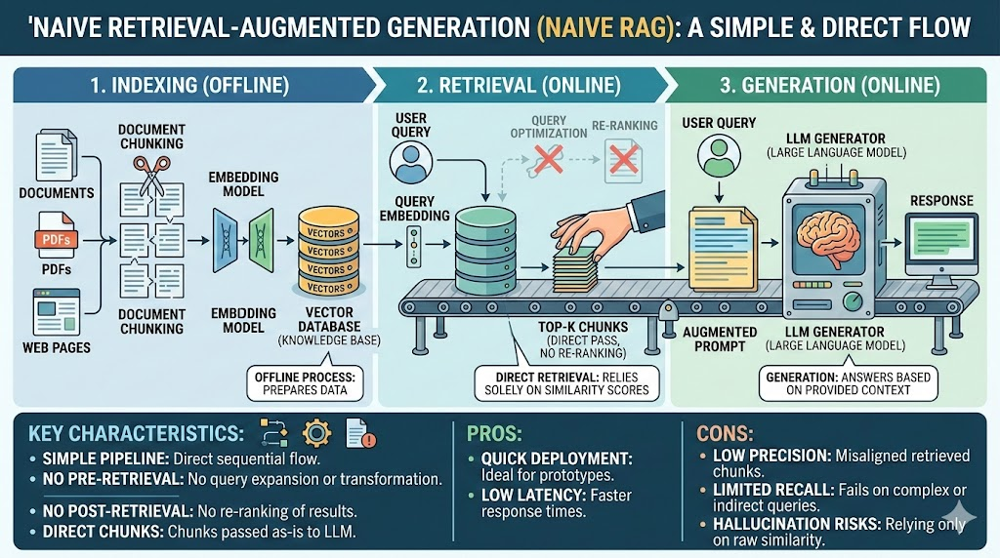
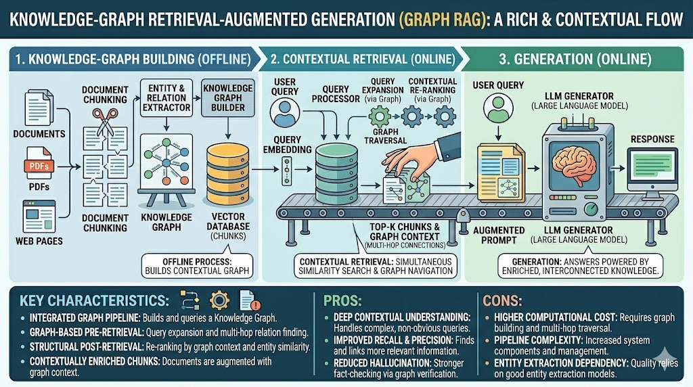
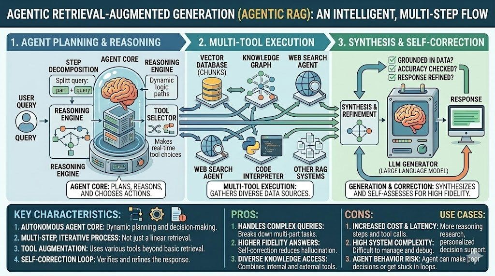

# RAG System

## What is RAG?

> RAG = Retrieval Augmented Generation

Instead of relying on what and LLM memorized during its training, you feed it the right information at query time.

## How RAG Works
Knowledge base is divided into data _chunks_ which becomes vectors which are then housed in a vector database.

LLM searches for relevant chunks/ vectors inside the DB when asked
questions, augmenting its answers with the data it retrieves

## Three Types of RAGS
- Naive RAG
- Graph RAG
- Agentic RAG

### Naive RAG
LLM pulls the most similar vector from
the DB based on semantic search to
augment its answer.

Simplest to create, quickest responses,
but the least accurate. Answers degrade
if required to reference multiple chunks.

### Graph RAG
Builds a knowledge graph based on
relationships between vectors, not just
semantic similarity.

Great for complex queries that require
multi document references. Harder to
build and more expensive.

### Agentic RAG
An Al agent orchestrates retrieval. It
decides what to search, checks quality,
and can hit multiple sources beyond the
vector database itself.

Most robust version but also the slowest,
most expensive, and hardest to build.

Original Poster: [chase.h.ai](https://www.instagram.com/chase.h.ai/)